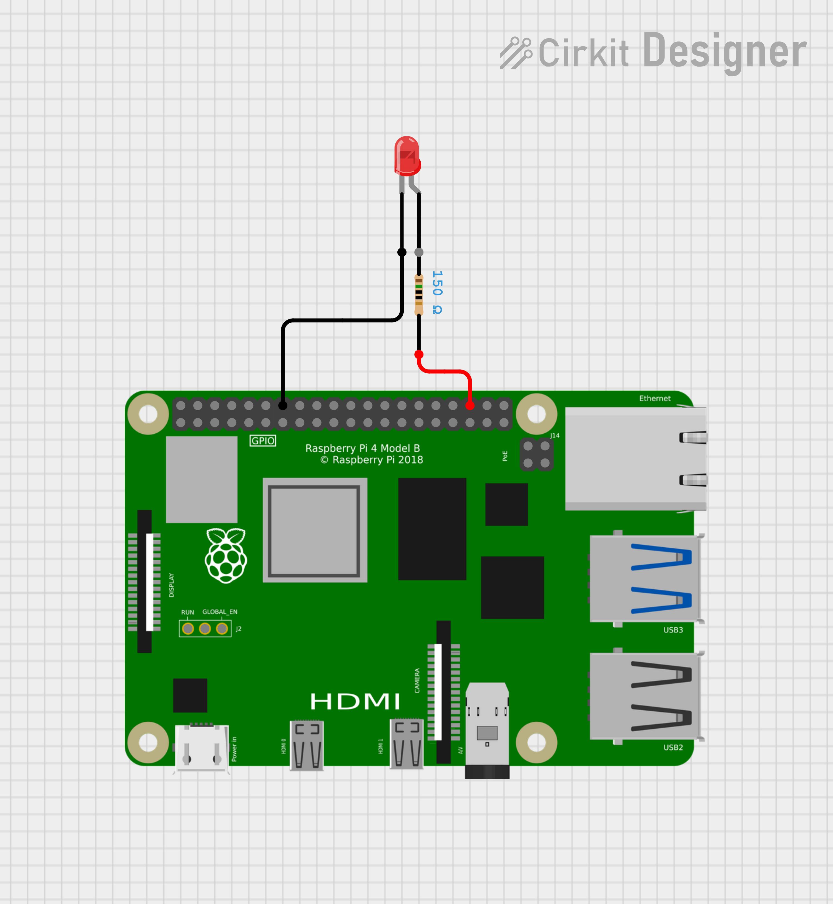
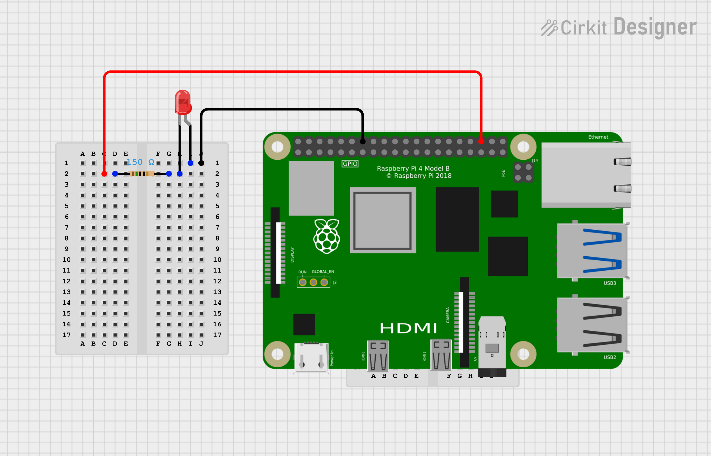

# Simple LED Hardware Sample

This demo shows how to turn on and off (blink) an LED on a Raspberry Pi using QNX.

We will demonstrate with 2 different hardward layouts, both of which work with this code sample:
1. An LED with a built in resistor that can be directly connected to the Raspberry Pi without need for a breadboard.
2. An LED without a built in resistor which is wired through a breadboard and then to the Raspberry Pi.

## Pin Configuration

Wire the LED according to one of the following schematic diagrams and connect to the Raspberry Pi.

- Red wire to GPIO 16 (pin 36)
- Black wire to pin 14 (Ground)

## Schematic Diagrams

This diagram shows a simple LED which as a built in resistor and can be directly connected to the Raspberry Pi.

This diagram shows a simple LED with a separate resitor connected to a breadboard and then to the Raspberry Pi.
