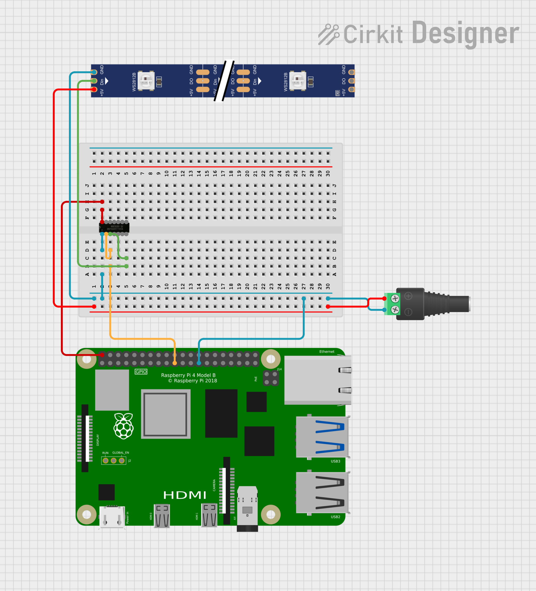

# WS281x LED Strips and Matrices

## Overview

This section contains several sample applications for driving LED strips and matrices using the the Raspberry Pi's SPI0 interface.  The libraries are being updated to support more SPI interfaces as we gradually enable additional SPI interfaces in the quick start target image.  Stay tuned for future updates.

The sample applications use two or more of the following libraries:

- librpi_spi (all sample applications)
- librpi_ws281x (all_sample applications)
- libmini_fastled (all but one sample applications)

Note: Because the SPI interface can only be accessed as root currently, all the sample applications will need to be executed as the root user.

### librpi_spi

This library provides the underlying logic to communicate with the SPI driver.  Sample applications only have to link this library and they are not accessing its APIs directly.

[librpi_spi](../common/librpi_spi)

### librpi_ws281x

This library provides a somewhat generic API to write colors to a collection of WS 281x LEDs.  It is suitable for simpler control of one or more LED strips, or one or more LED matrixes, but it does not contain specialized logic for managing matrices in a transparent fashion.

This library is a smaller port of the Linux library of the same name [https://github.com/jgarff/rpi_ws281x](https://github.com/jgarff/rpi_ws281x), but the port focuses only on the SPI driver of the original library and the implementation of the SPI logic is based on [librpi_spi](../common/librpi_spi).  The interface has been mostly retained but some minor changes were made because the port only covers SPI functionality.

The [rpi-ws281x-rainbow](rpi-ws281x-rainbow) sample application demonstrates how to use this API.

[librpi_ws281x](../common/librpi_ws281x)

### libmini_fastled

The mini_fastled library is based on the well known [FastLED](https://fastled.io/) library, but is not a complete port, at least not yet.  The current approach to the port was inspired by another attempted port to Raspberry Pi found at [https://github.com/apleschu/FastLED-Pi](https://github.com/apleschu/FastLED-Pi) which leveraged the Linux rpi_ws281x library as well, but the approach we used for mini_fastled differs in many ways.

The QNX port has some significant differences from the original library:

- The QNX port is based on a C API, instead of C++, but the API is meant to be similar in some ways to the INO script APIs for FastLED, so that
  translation from INO script to C code is not too onerous.
- The library is layered on [librpi_ws281x](../common/librpi_ws281x), so certain data types are matched under the hood to that library's data types.
- Some of the lower level code required for tiny processors supported by FastLED is replaced with aliases to C functions for the RaspBerry PI.

Our goal is to port several INO script examples from the FastLED web site to sample applications to provide a fairly good coverage of the interesting functionality that is provided by FastLED.

[libmini_fastled(../common/libmini_fastled)

## Content

### rpi-ws281x-rainbow

This folder contains code for a simple demonstration of how to use the rpi_ws281x library to drive an LED matrix.  The sample application assigns some colors to a strip of LEDs that render a rainbow over twenty pixels and then shift up and over the colored pixels.

[rpi-ws281x-rainbow](rpi-ws281x-rainbow)

### mini_fastled

This folder contains a number of sample applications that have been adapted from INO examples from
the FastLED web site.  Check the folder for more details.

[mini_fastled](mini_fastled)

## Circuit

This diagram shows a representation of a circuit connecting one LED strip to a Raspberry Pi 4, a 5V power supply and using a [74AHCT125 - Quad Level-Shifter (3V to 5V)](https://www.adafruit.com/product/1787) from AdaFruit as a level inverter to scale up the 3.3V voltage from the SPI0 MOSI output to the 5V required by the LED strip.

